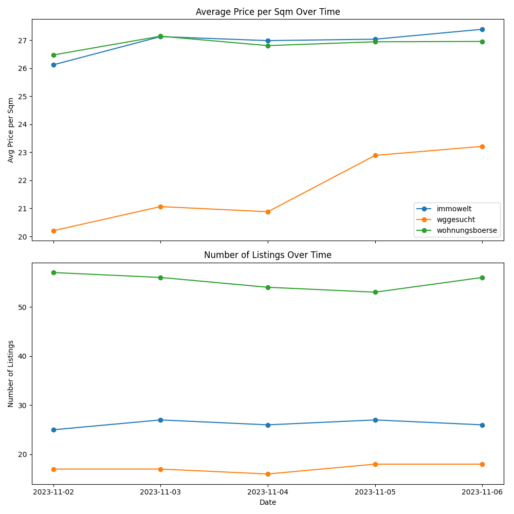

# Webscraping German Real Estate Portals
Scraping of real estate portals for comparing average prices per square meter

## Installation
Requirements: Python 3.7+

Required Packages can be retrieved from [requirements.txt](https://github.com/ls-schwnstr/Webscraping_Real_Estate_Portals/blob/main/requirements.txt)

## Overview
The selected project task involved extracting data from three different real estate portals. The main objective was to find out which of these portals has the most extensive range of rental apartments in the Munich district of Haidhausen and at the same time to determine the differences in the aver-age price per square meter on the three platforms. This task was carried out in several steps: First, the websites were scraped over a period of five days, then the extracted data was stored in an HDF5 file. The final steps included the calculation of average prices and the visualization of the de-veloping trends in prices and offers. 

